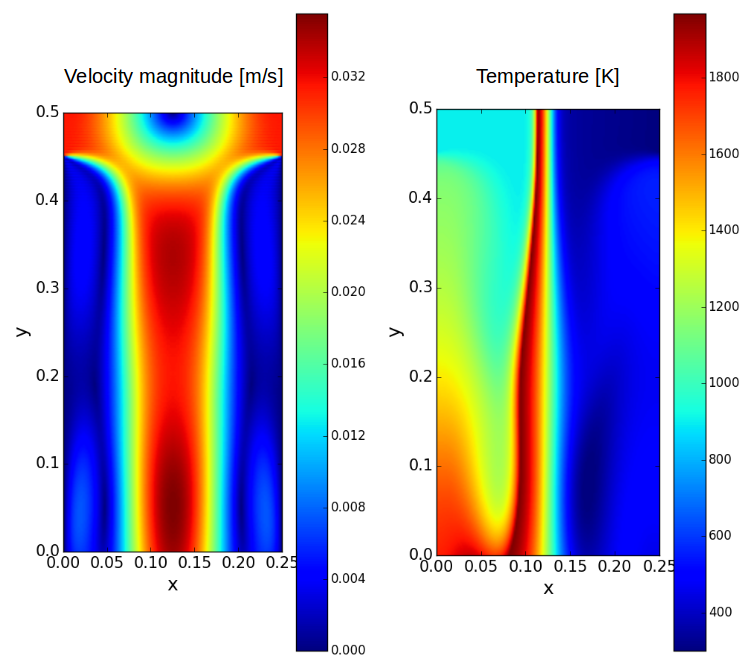
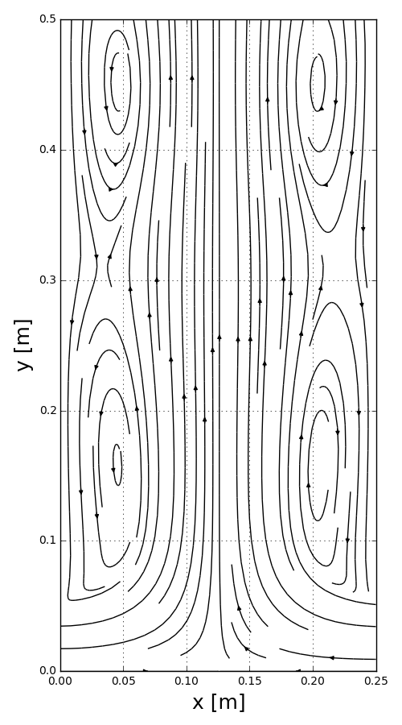
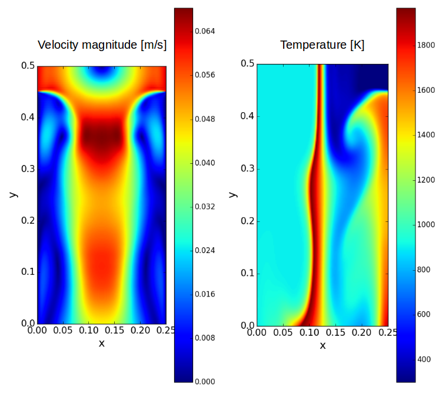
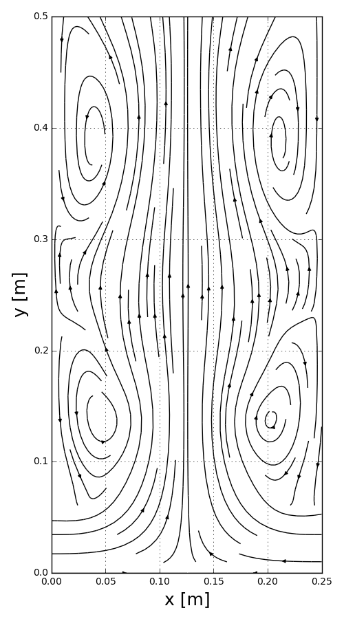
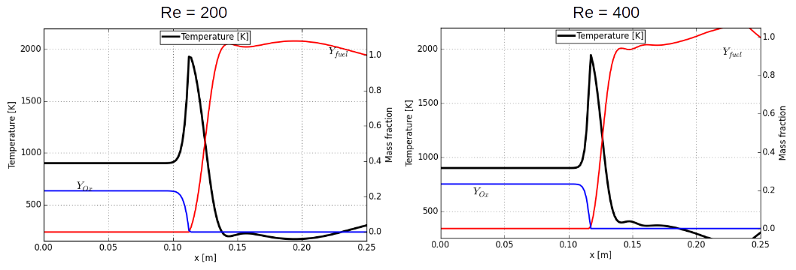

===============================
 Reacting case (High Re number)
===============================

In this section, more discussions of the effect of high reynolds number on the flame structure and flow field are made. In addition to the previous Re=100, here we introduce two more high Reynolds number conditions to the same problem. Except for the inlet speed, everything else remain unchanged for the initial and boundary conditions. 

The most significant features from the higher Reynolds number conditions can be viewed from the more unstable and unsteady flow features. Multiple vortices can be found from the velocity magnitude and flow stream lines figures. As compared to the previous case, the flame gets thinner as Reynolds number increases. In addition, because of the flow unsteadiness the convergence rate never goes below the desired value of 0.01%. The repeatedly created vortices tend to make residual more fluctuated and hamper steadiness.

- **Velocity magnitude and temperature contours, and flow streamlines (Re=200)**

The higher Reynolds number conditoins cannot be made with the current setup because the height of the domain is not sufficiently long to ensure the fully developed flow within the length. As found in the Re=400, the vortices seems to be more unstable and highly dilated. The flame thickness gets much more thinner.

- **Velocity magnitude and temperature contours, and flow streamlines (Re=400)**

The flame structure qualitatively looks similar to the previous low Reynolds number case. Mostly interestingly, the flame reaction zone is formed within a shorter distance because of the higher momentum of two streams. Unfortunately, these two higher Reynolds number conditions make the maximum mixture fraction go over unity which is not acceptable theoretically. But in the numerical simulation, that can happen with some possible numerical instability. Because of the inherent oscillation feature of second order finite difference, the numerical instability seems to happen in the high velocity region which also possibly make stiff gradient in the flux computation.

- **Flame structure**

