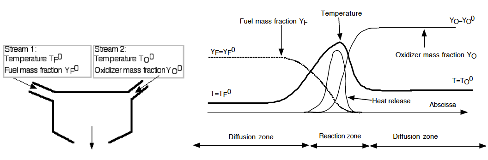
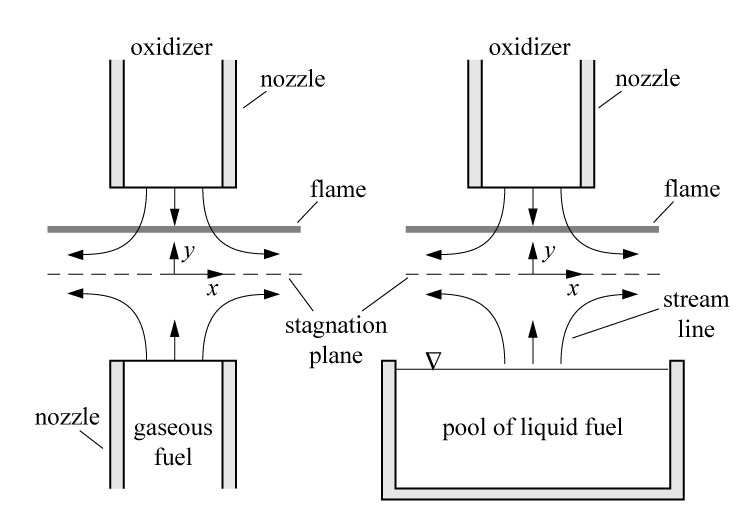

=============
 Introduction
=============

This project aims to develop a theoretical tool for diffusion flame. To clarify the combustion physics of diffusion flame, diffusion flame is a class of combustion study with a flame in which the oxidizer combines with the fuel in reactor. In other words, the fuel and oxidizer streams independetly enters into the reactor and meets together forming a instantaneous mixture create in space. This type of burning process is thus mainly dominated by the diffusion process. Diffusion flames tend to burn slower and is known to produce more soot because of possible insufficient oxidizer concentration for the complete reaction to take place.

The figure shown below illustrates a simplified configuratoin of diffusion flame formation with separated fuel and oxidizer streams. The figure on the right shows the qualitative thermodynamic properties of mixture along the axis normal to the diffusion flame surface. This clarifies the diffusion flame structure and tells that high-temperature flame zone is located at the position where the fuel and oxidizer streams meet together at a certain condition, which is stoichiometric mixture that will be later discussed.

To simplify the theoretical analsys in the diffusion flame, many studies idealized situations of this type of flame introducing the passive scalar concept that is mathmatically manipulated variables from the physical properties of mixture. To introduce the passive scalar, several idealized assumptions need to be introduced and stated as listed below:

  - Thermodynamic pressure is constant and Mach numbers are small.
  - All the diffusion coefficients :math:`D_{k}` of chemical species are equal to :math:`D`. Fick's law, without velocity correction, is used for diffusion velocities.
  - The heat capacities :math:`C_{p}` of chemical species are all identical and independent of temperature, calorically perfect gas.

Introducing passive scalar that well represents the flame properties allows us to solve a linear set of equations in a simplified form of single transport equation. Then resolved passive scalar contains all the information of flame properties and can be converted to desired quantities of interest. 

In this project, a planar counterflow diffusion flame is employed to discuss. Counterflow diffusion flames are very often used experimentally because it is well representative of one-dimension diffusion flame structures. Following figure illustrates the diffusion flame configuration that fuel and oxidizer streams issues on opposite side facing to each other. 

